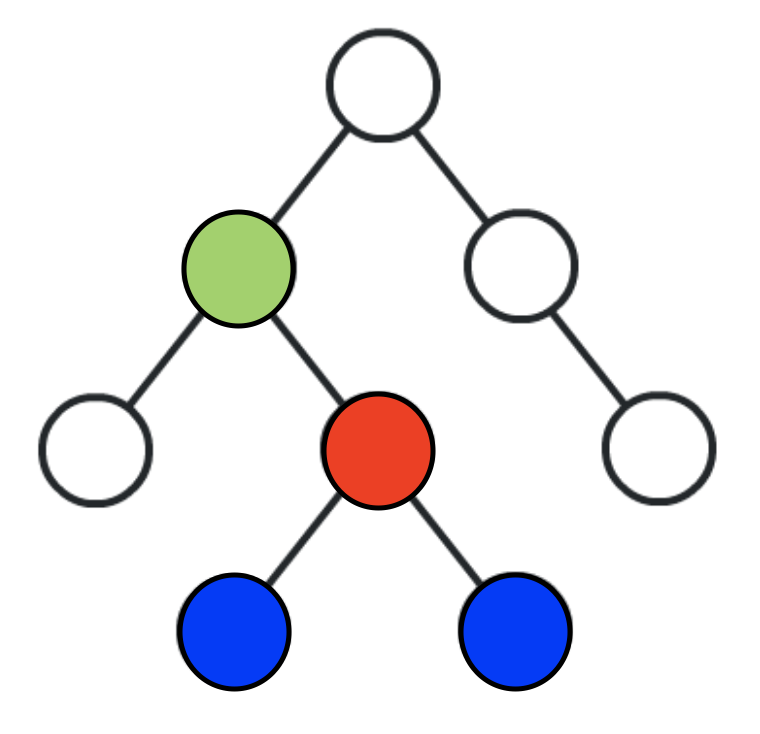
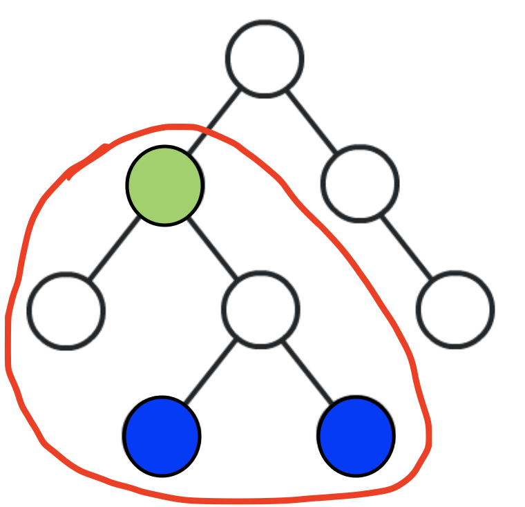

## 리액트가 변하고 있다(?)

React 가 Hook을 내장시킴에 따라 많은 라이브러리들이 Hooks API 를 지원하고 있습니다.

> 어차피 5-6개월 있으면 또 새로운 거 나와서 다시 새로 배워야 되는거 아냐?
> 도대체 Hook이 뭔데?

Hook은 state와 LifeCycle을 관리하는 새로운 방법입니다. Class Component에서는 사용할 수 없으며, Functional Component에서만 사용해야 합니다.

Functional Component는 Class Component에 비해 초기 마운트가 미세하게 빠르고, 메모리 소모량이 적습니다.

하지만, 초기 마운트가 빠르고, 메모리 소모량이 적을 수 있는 이유는 state 와 LifeCycle 등의 기능이 없어서이기 때문에, state를 가져야 하는 컴포넌트는 함수형으로 만들 수가 없었습니다.

React가 내놓은 Hooks가 바로 Functional Component에서 state와 LifeCycle을 관리할 수 있게 해주는 녀석입니다.

많은 라이브러리에서 Hook을 지원하려는 걸 보면서 많은 개발자들이 Class Component보다 Functional Component를 더 선호하고 둘의 차이를 좁히기 위해 노력하고 있다고 느낍니다.

점점 더 많은 프로젝트들이 Hook과 함께 Functional Component 기반으로 migration 될 것이고, 변하고 있는 이 흐름은 공부할 가치가 충분하다고 생각합니다.

---

## Redux, MobX 에서도?

### react-redux는 v7.1 부터 mobx-react는 v6 부터 hook API를 지원하고 있습니다.

> Redux와 MobX는 React의 특성인 단방향 바인딩(데이터의 흐름이 단방향으로 흐르는)에 의해 생길 수 있는 여러 단점들을 해결하기 위해, Context 를 생성하여 데이터를 트리 단위로 주입하여 데이터를 전역적으로 관리할 수 있는 라이브러리이며, React에 내장된 Context API를 기반으로 구현이 되어있습니다. (React에 Context API가 도입된 이후 mobx-react는 injection pattern을 Context API 기반으로 migration 할 것을 권장하고 있습니다.)

### Context API란?

다음 두 예시의 차이를 들어 Context API에 대해 좀 더 자세히 설명하겠습니다.

초록색의 컴포넌트의 state를 파란색의 컴포넌트들에서 사용하려고 하면, 초록색에서 파란색들한테 props를 넘겨주기 위해 중간에 그 props가 필요 없는 빨간색의 컴포넌트에까지 props를 전달해주어야 합니다. 이러한 방식에서 트리의 level이 깊어질수록 불편함은 커집니다.

Context를 생성하고, 해당 Context의 value(어떤 데이터(store, state 등)를 사용할 지)를 정합니다.
빨간색의 원 구역만큼의 트리를 해당 Context의 Provider로 감싸주면, Provider의 영역 안에 있는 컴포넌트라면 어떤 컴포넌트든 Context의 Consumer를 통해 Context의 value를 구독할 수 있습니다.(Hook의 useContext로 Consumer를 대체할 수 있음)
즉, 초록색과 파란색 사이의 컴포넌트는 건너 뛰고 파란색 컴포넌트들에서 바로 Consumer(or useContext)를 이용하여 Context의 value를 사용할 수 있습니다.

---

## MobX with Hooks

### Hook을 지원하는 mobx-react-lite가 mobx-react에 v6 부터 내장되었습니다.

### 설치

    npm install mobx mobx-react-lite(or ~v6 mobx-react)
    or
    yarn add mobx mobx-react-lite(or ~v6 mobx-react)

### Store 구현 코드

다음과 같이 Store를 구현합니다.

    // ~store/tokenStore.tsx

    export type TToken = {
      symbol: string,
      balance: number
    }

    export function tokenStore() {
      return {
        tokenList: [{symbol: "BTC", balance: 0}] as TToken[],
        addToken(token: TToken) {
          this.tokenList = [...this.tokenList, token];
        },
        get totalBalance() {
          return this.tokenList.reduce((prev, current) => {
            return prev + current.balance
          }, 0);
        }
      };
    }

    export type TTokenStore = ReturnType<typeof tokenStore>

### Context 구현 코드

위에서 구현한 Store를 mobx-react-lite의 useLocalStore를 사용하여 진짜 Store로 만들고, 생성한 Context Provider value에 넣어줍니다.

useLocalStore는 내부 리소스를 observable 하게 만들어 줍니다.

    // ~store/useTokenStore.tsx

    import React from 'react'
    import { tokenStore, TTokenStore } from './tokenStore'
    import { useLocalStore } from 'mobx-react-lite'

    const tokenStoreContext = React.createContext<TTokenStore | null>(null);

    interface ITokenStoreProvider {
      children: JSX.Element
    };

    export const TokenStoreProvider = (props: ITokenStoreProvider) => {
      const store = useLocalStore(tokenStore);

      return (
        <tokenStoreContext.Provider value={store}>
          {props.children}
        </tokenStoreContext.Provider>
      );
    };

    export const useTokenStore = () => {
      const store = React.useContext(tokenStoreContext);

      if (!store) {
        throw new Error('You have forgot to use StoreProvider, shame on you.');
      }

      return store;
    };

### Store 생성 코드

다음과 같이 useTokenStore()를 호출하여 구현해 놓은 Store를 생성합니다.

    import { useTokenStore } from "../store/useTokenStore";
    import { useObserver } from "mobx-react-lite";

    const TokenComponent = () => {
      const store = useTokenStore();

      return useObserver(() => (
        ...
      ));
    }

### Store Provider

마지막으로, 위에서처럼 TokenComponent 에서 (내부에 useContext(tokenStoreContext)로 구현되어 있는) useTokenStore를 사용할 수 있으려면, TokenComponent를 (내부에 tokenStoreContext.Provider로 구현되어 있는) TokenStoreProvider로 감싸줘야합니다.

    import { TokenStoreProvider } from "../store/useTokenStore";

    export const App = () => {
      return (
        <TokenStoreProvider>
          <TokenComponent />
        </TokenStoreProvider>
      )
    }

> 잠깐, Store를 생성할 때, inject 없이 useTokenStore()로 생성하네요?

store injection pattern은 React에 Context API 가 도입되기 이전의 Legacy Context를 사용하기에 불편한 점이 많아 도입되었으며, mobx-react 라이브러리에 의해 대중화되었습니다.

하지만, 지금은 Context API 등 Legacy Context를 대체할 수 있는 더 좋은 툴이 많기 때문에, mobx-react 공식문서에서는 injection pattern을 obsolete(더 이상 쓸모 없는)한 것으로 간주하고 migration 할 것을 권장하고 있습니다.

> 그러고보니 observable, computed, action 등도 안보이네요?

현재 mobx-react-lite에 useObservable, useComputed 가 내장되어 있지만, github mobx-react-lite repo를 보면 이 둘 대신에 useLocalStore를 사용하라고 합니다. (곧 없어질 것 같네요.)

useLocalStore는 Component instance 당 한 번만 생성되며, 재생성 되도록 강제할 수 없습니다.

또한, 위의 예제처럼 React Context의 도움을 받아 component tree를 이동하며 전역 상태로 관리될 수 있습니다.

---

## Reference

- [https://boxfoxs.tistory.com/395](https://boxfoxs.tistory.com/395)
- [https://github.com/mobxjs/mobx-react](https://github.com/mobxjs/mobx-react)
- [https://github.com/mobxjs/mobx-react-lite](https://github.com/mobxjs/mobx-react-lite)
- [https://mobx-react.js.org/](https://mobx-react.js.org/)
- [https://dev.to/davidyushkov/mobx-and-react-hooks-getting-started-4ff2](https://dev.to/davidyushkov/mobx-and-react-hooks-getting-started-4ff2)
- [https://blog.rhostem.com/posts/2019-07-22-mobx-v6-and-react-v16-8](https://blog.rhostem.com/posts/2019-07-22-mobx-v6-and-react-v16-8)
